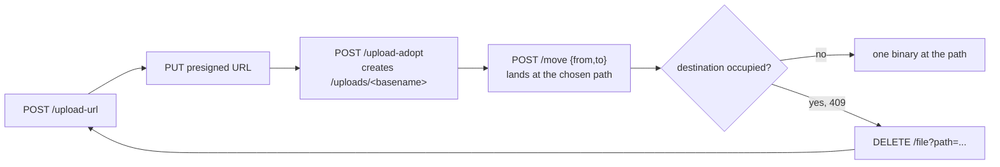

# Studio place-a-binary-at-a-path protocol

Observed behavior for putting binary bytes at a **chosen** project path, and for
replacing bytes that are already there. These are undocumented implementation
details captured from a disposable project and may change without notice.

This document is **evidence** for
[#38](https://github.com/iNcredibleGM/rundot-game-studio-sync/issues/38). It
does not add a product call. The sequence it proves is not wired into `Push`;
[#41](https://github.com/iNcredibleGM/rundot-game-studio-sync/issues/41) owns
that.

Related prior work:

- [#15](https://github.com/iNcredibleGM/rundot-game-studio-sync/issues/15) /
  [binary-upload-protocol.md](binary-upload-protocol.md): the upload flow
  ignores the requested path, and a repeated name creates a numeric-suffixed
  sibling instead of replacing.
- [#16](https://github.com/iNcredibleGM/rundot-game-studio-sync/issues/16) /
  [delete-rename-protocol.md](delete-rename-protocol.md): `POST /move` honors an
  arbitrary destination, preserves bytes, and refuses an occupied destination
  with `409 ALREADY_EXISTS`; `DELETE` removes exactly one named path.
- [#37](https://github.com/iNcredibleGM/rundot-game-studio-sync/issues/37) /
  [text-create-protocol.md](text-create-protocol.md): the same two-step landing
  was first observed for text, with a follow-up `PUT /file` for exact bytes.

Read paths are in [protocol.md](protocol.md).

## The question

The upload flow alone cannot choose a path and cannot replace a file. A repeated
name creates a numeric-suffixed sibling. `POST /move` can relocate bytes and
refuses to overwrite (`409`). `DELETE` removes exactly one named path.

Can a sequence end with **one binary at the requested project path and no
leftover sibling**? If it cannot, the product must keep refusing binary publish.

## Answer

**Yes, it can — in two steps for a new path, and three for a replacement.**



Two properties decide every case below:

1. The upload step is only how the bytes come into existence; `POST /move` is
   the step that chooses the path.
2. A move never clobbers, so a replacement is `DELETE` then place, not a move
   onto the occupied path.

The upload half is unchanged from #15: the requested path is still ignored and
the file still lands at `/uploads/{basename}`. The move half is unchanged from
#16. What #38 adds is the end-to-end proof that the composition lands one file
at the chosen path with the staging copy gone.

## Endpoints

```text
POST /api/projects/{projectId}/upload-url
Content-Type: application/json

{ "declaredSize": 71 }
```

```text
PUT {uploadUrl}
Content-Type: image/png

<raw bytes>
```

```text
POST /api/projects/{projectId}/upload-adopt
Content-Type: application/json

{ "uploadId": "<minted upload id>", "name": "sprite.png" }
```

```text
POST /api/projects/{projectId}/move
Content-Type: application/json

{ "from": "/uploads/sprite.png", "to": "/src/assets/sprite.png" }
```

```text
DELETE /api/projects/{projectId}/file?path={encodedPath}
```

The first, third, fourth, and fifth are Studio routes and need the bearer token.
The presigned `PUT` targets object storage directly and is unauthenticated.

## The sequence lands one binary at a chosen path

Upload a unique name, adopt it, then move it to the destination:

| Step | Status | Result |
| --- | --- | --- |
| `upload-url` | `200` | minted a presigned URL and an `uploadId` |
| presigned `PUT` | `200` | 71 bytes sent |
| `upload-adopt` | `200` | recorded `/uploads/probe-…-sequence.png` |
| `POST /move` to `/sync-probe/probe-…-placed.png` | `200` | destination honored |
| staging source listed after | **no** | the `/uploads` path is gone |
| destination listed after | **yes** | 71 bytes |
| sent SHA-256 / read-back SHA-256 | `85e426eb…` / `85e426eb…` | **preserved** |

The move response echoes the real relocation:

```json
{ "success": true,
  "data": { "from": "/uploads/probe-…-sequence.png",
            "to": "/sync-probe/probe-…-placed.png" } }
```

So the end state is exactly one file at the requested path. The staging path is
not left behind, because a move is a relocation rather than a copy.

## Collision names: the sequence must not leave `name-1` behind

A repeated upload name still collides, exactly as #15 recorded. This is the case
the issue calls out by name, so it is proven explicitly:

| Step | Result |
| --- | --- |
| First adopt of basename `probe-…-collide.png` | `200`, recorded `/uploads/probe-…-collide.png` |
| Second adopt of the **same** basename | `200`, recorded `/uploads/probe-…-collide-1.png` |
| Sibling detected | **yes** (recorded path differs from the first) |
| `DELETE` the sibling | `200`, removed |
| `POST /move` the original to `/sync-probe/probe-…-collide-placed.png` | `200` |
| Sent SHA-256 / read-back SHA-256 | `7c134fca…` / `7c134fca…` (preserved) |
| Any `-<n>` sibling left | **none** |

The important detail is that the collision is **visible in the adopt response**:
the second adopt does not return the requested name, it returns the suffixed
name it actually recorded. A client that reads the recorded path can delete the
sibling it did not want. A client that assumes the requested name was honored
would leave `name-1` behind and would be moving the wrong file.

This is also why the probe never matches a created file by filename substring: a
substring test for `name` would hide the very sibling the case is looking for.

## Replacement: delete-or-move, and the old bytes are provably gone

A move onto an occupied destination is refused (`409`), so a replacement cannot
be a single move. The proven replacement is `DELETE` then place:

| Step | Status | Result |
| --- | --- | --- |
| Place bytes A at the path | `200` | destination SHA-256 `fe9a9478…` |
| Second placement onto the occupied path | **`409`** | destination SHA-256 still `fe9a9478…` |
| Occupied bytes unchanged by the refusal | **yes** | the `409` changed nothing |
| `DELETE` the path | `200` | removed |
| Path absent from `GET /files` | **yes** | |
| `GET /file` on the deleted path | **failed** (`404`) | the old bytes are gone |
| Place bytes B at the same path | `200` | |
| Final SHA-256 | new bytes | `oldBytesGone = true`, `newBytesPresent = true` |

So replacement is achievable, but it is **not** an in-place overwrite: it is a
delete plus a fresh landing. The `409` is a genuine safety property — the refused
move left the occupied bytes byte-for-byte identical — which is the opposite of
`PUT /file`, where a stale write silently replaces whatever is there
([text-write-protocol.md](text-write-protocol.md)).

## A failed step mid-sequence

Each failure shape was exercised, and what it leaves behind was listed and then
cleaned up:

| Failure | Status | What is left |
| --- | --- | --- |
| `POST /move` from a source that does not exist | `404` `not found` | nothing moved |
| `POST /move` onto an occupied destination, from a fresh source | **`409`** `ALREADY_EXISTS` | source still listed; destination unchanged |
| `POST /upload-adopt` with a fabricated `uploadId` | `400` | nothing |
| `PUT` to a URL that is not a presigned target | **no HTTP status** | transport failure only |

The occupied-destination case is the one worth reading carefully. The source
must be a file that has **not** already been moved: occupying a destination
consumes its own `/uploads` source, so a "second move from the same path" would
test an absent source (`404`) and silently prove nothing. With a fresh source,
the refusal is a real `409` and both sides are provably intact.

Cleanup: the run left **6** paths behind across these cases (the placed files
plus the un-moved sources), and all **6** were deleted and verified gone. A
failure mid-sequence therefore leaves ordinary, cleanable artifacts — never a
half-written file at the destination, because the destination is only ever
written by a move that either fully succeeds or is refused.

The malformed-URL case confirms #15's warning: the request failed at the
transport layer (`The remote name could not be resolved`), so a client must
treat it as a hard failure rather than an ambiguous write to retry blindly.

## Leading-dot names and paths outside `/uploads`

| Destination | `POST /move` status | Listed after | Note |
| --- | --- | --- | --- |
| `/sync-probe/.probe-…-dot.png` (leading dot) | `200` | **yes** | the dot is **preserved** |
| `/sync-probe/src/assets/probe-…-nested.png` (nested) | `200` | **yes** | destination honored verbatim |
| `/.git/probe-…-reserved.png` | `404` `not found` | no | |
| `/.rundot-sync/probe-…-reserved.png` | **`200`** | **yes** | server accepted |
| `/.rundot/probe-…-reserved.png` | **`200`** | **yes** | server accepted |
| `/../probe-…-escaped.png` | `400` | no | `to must be a normalized absolute project path` |

Two findings matter for the product:

- **A leading dot is preserved by a move.** The upload flow *strips* a leading
  dot from the filename (#15 recorded `.probe-d` as `probe-d`), but a move
  destination keeps it. So a dotfile can reach its real path, but only via the
  move step — the upload step cannot be the source of the dot.
- **Reserved paths have no uniform server guard.** `/.git/…` returned `404`,
  while `/.rundot-sync/…` and `/.rundot/…` returned `200` and were created. A
  `404` on `/.git/…` must not be read as protection: it is the same `404` an
  absent path returns. The client-side reserved-path rule
  ([path-safety.md](path-safety.md)) stays **load-bearing**, exactly as #37
  found for `POST /move` and #16 found for `DELETE`.

Because a move can place a file at a reserved-shaped path, a probe's cleanup
scope has to include those directories when the leaf carries a run stamp.
Otherwise the run reports a clean project while leaving files behind. The probe
now does this.

## Idempotency and retry

| Question | Answer |
| --- | --- |
| Is the landing idempotent? | **No.** A second placement at an occupied path is `409`, not a merge. |
| Is the `409` safe to retry? | Yes in effect: the destination is unchanged, so nothing is destroyed. |
| Is a repeated `DELETE` safe? | Yes in effect: `200` then `404`, same postcondition. |
| Does a retry after an ambiguous move duplicate a file? | Not at the destination — the move either happened or was refused. |
| Does a retry after an ambiguous adopt duplicate a file? | **Yes.** Identical bytes and name create a second `/uploads` file (#15). |

The adopt step remains the one non-idempotent layer, so a retry after an
ambiguous failure can leave an extra `/uploads` staging file. That is detectable
by hashing candidates and is removable with `DELETE`.

## Refinement to #15: the presigned `PUT` now returns an `ETag`

[binary-upload-protocol.md](binary-upload-protocol.md) recorded "No `ETag` or
other identity header was returned" for the presigned `PUT`. In this run the
presigned `PUT` **did** return an `ETag` header (object storage's, not Studio's),
identical across uploads of identical bytes — consistent with a content digest
of the uploaded object.

This does **not** change the design. It is the storage object's identity, not a
Studio revision: `GET /files` still exposes no hash for a binary, the `ETag` is
not offered on the Studio routes, and the landing path and its identity are
decided by `POST /move` afterwards. A client that needs to verify remote content
must still fetch the file and hash it itself.

## Consequence for `Push` and [#41](https://github.com/iNcredibleGM/rundot-game-studio-sync/issues/41)

A binary `upload` row is publishable, but only through the proven shape:

1. Upload a **unique** staging name and read the path the adopt response
   actually recorded. Never assume the requested name was honored.
2. If the recorded path differs from the requested basename, `DELETE` the
   sibling before moving, so the sequence cannot leave `name-1` behind.
3. `POST /move` onto the planned path. A `409` means the destination is
   occupied: this is a replacement, not a create, and it must be an explicit
   decision rather than a silent clobber.
4. For a replacement, `DELETE` the existing path first, then land the new bytes.
   Verify the old bytes are gone and the new bytes are present by hashing.
5. Keep refusing locally on `.git/`, `.rundot-sync/`, and `..`, even though a
   move onto `/.rundot-sync/…` returns `200`.

What stays refused:

- A single-request binary create at an arbitrary path. It does not exist; the
  landing is always two steps.
- An in-place binary overwrite. Replacement is delete-then-place.
- Publishing a binary to any path other than the one the plan named. The
  sequence can reach any path, but a plan row is only satisfied when the
  recorded destination equals the planned path.

The product sequence lives in `lib/RemoteBinaryPlace.ps1` and is applied by
`Push` ([#41](https://github.com/iNcredibleGM/rundot-game-studio-sync/issues/41)).
See [binary-place.md](binary-place.md).

## How this was observed

Scenario `run-binary-place-all` in
[tools/StudioProbe.ps1](../tools/StudioProbe.ps1) against a disposable Studio
project, with `-ConfirmRemoteWrite`. It ran the sub-scenarios
`binary-place-sequence`, `binary-place-collision-cleanup`,
`binary-place-replace`, `binary-place-failure`, `binary-place-edge-names`, and
`binary-place-survey`, then deleted what it created and verified none remained.

Every destructive case built its own target through the upload flow, because the
text route cannot create a file. Delete targets are guarded twice: only
`/sync-probe`, a run-stamped `/uploads` path, or a run-stamped reserved-shaped
path is eligible, and the guard refuses a bare directory. The run ended with
`deleted 6/6, 0 remaining`, and an independent `GET /files` check confirmed the
project held only its original 139 files.

Evidence files contain status codes, sizes, SHA-256 digests, and response bodies
only. No tokens, credentials, or project file contents are recorded.

## Related contracts

- The upload flow, which cannot choose a path: [binary-upload-protocol.md](binary-upload-protocol.md).
- Move, delete, and concurrency semantics: [delete-rename-protocol.md](delete-rename-protocol.md).
- The text create sequence this mirrors: [text-create-protocol.md](text-create-protocol.md).
- Local path safety and reserved paths: [path-safety.md](path-safety.md).
- Byte-identity model the write must match: [classifier.md](classifier.md).
- Route index: [protocol.md](protocol.md).
