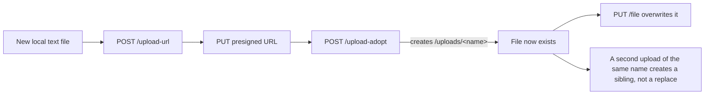

# Studio binary upload protocol

Observed behavior of the only Studio route that creates a binary file. These
are undocumented implementation details captured from a disposable project and
may change without notice.

This document is **evidence only**. Nothing in the product calls these routes:
`game-studio-sync.ps1` remains GET-only, and `Push`/`Apply` do not exist. The
purpose of the record is to constrain the design of
[#17](https://github.com/iNcredibleGM/rundot-game-studio-sync/issues/17), not to
permit a write.

Read paths are in [protocol.md](protocol.md). The text write route is
[text-write-protocol.md](text-write-protocol.md); this document covers only the
binary upload flow. Delete, rename, and concurrency are characterized in
[delete-rename-protocol.md](delete-rename-protocol.md).

## Endpoints

Three requests, in order:

```text
POST /api/projects/{projectId}/upload-url
Content-Type: application/json

{ "declaredSize": 71 }
```

```text
PUT {uploadUrl}
Content-Type: image/png

<raw bytes>
```

```text
POST /api/projects/{projectId}/upload-adopt
Content-Type: application/json

{ "uploadId": "<minted upload id>", "name": "sprite.png" }
```

The first and third are Studio routes and need the bearer token. The second
targets object storage directly and is unauthenticated: the presigned URL
carries its own signature.

### Step 1 - `upload-url`

Only **`declaredSize`** is required, and it must be a positive integer:

```json
{ "success": false,
  "error": { "message": "declaredSize must be a positive integer",
             "code": "VALIDATION_ERROR",
             "field": "declaredSize" } }
```

`fileName`, `path`, and `contentType` are accepted but **none of them is
validated and `path` is never used** (see below). An empty body and a body with
only `fileName` both return the same `declaredSize` error.

A successful response mints an upload identity:

```json
{ "mode": "direct",
  "uploadUrl": "https://<bucket>.r2.cloudflarestorage.com/...?X-Amz-Expires=900&...",
  "uploadId": "<minted uuid>" }
```

- `mode` was always `"direct"`; no other mode was observed.
- `uploadId` is a UUID and is the token `upload-adopt` requires.
- `uploadUrl` is a time-limited presigned URL (`X-Amz-Expires=900`, so 15
  minutes).

### Step 2 - presigned `PUT`

Raw bytes, no `Authorization` header. Returns `200` with an empty body.

| Attempt | Result |
| --- | --- |
| Correct `Content-Type: image/png` | `200` |
| `Content-Type: application/octet-stream` for PNG bytes | `200` |
| The same presigned URL PUT twice | `200` both times |

The content type is not enforced, and the URL is reusable within its lifetime.
No `ETag` or other identity header was returned.

> **Refinement from [#38](https://github.com/iNcredibleGM/rundot-game-studio-sync/issues/38).**
> A later run observed the presigned `PUT` **returning** an `ETag` header
> (object storage's, identical across uploads of identical bytes). It is the
> storage object's identity, not a Studio revision: `GET /files` still exposes
> no hash, and the landing path is decided by `POST /move` afterwards. A client
> that needs to verify remote content must still fetch and hash it itself. See
> [binary-place-protocol.md](binary-place-protocol.md).

### Step 3 - `upload-adopt`

Requires `uploadId`, and then `name`. The server validates in that order:

| Body | Result |
| --- | --- |
| `{}` | `400` `uploadId must be a minted upload id` |
| `{"uploadId":"not-a-minted-upload-id"}` | `400` `uploadId must be a minted upload id` |
| `{"uploadId":"<real id>"}` | `400` `name is required` |
| `{"uploadId":"<real id>","name":"x.png"}` | `200` |

A successful adopt echoes the file it recorded:

```json
{ "path": "/uploads/x.png", "name": "x.png", "size": 71, "mimeType": "image/png" }
```

Note what is missing: no hash, no etag, no version, no revision, no `id`. The
identity vocabulary is the same as the text route's — path and size only.

## The requested path is ignored

**This is the single most important finding for `Push`.** `upload-adopt`
records the file under `/uploads/<basename>` regardless of what the request
asked for. The directory is discarded; only the basename survives.

| Requested `path` | Path the server recorded |
| --- | --- |
| `/sync-probe/pc-uploads.png` | `/uploads/pc-uploads.png` |
| `/pc-root.png` | `/uploads/pc-root.png` |
| `/sync-probe/deep/pc-nested.png` | `/uploads/pc-nested.png` |
| `/src/pc-src.png` | `/uploads/pc-src.png` |

`upload-url` accepts a `path` field without complaint but does nothing with it.
Sending the same `fileName` with three different `path` values produced three
ordinary `200` responses, each with a fresh `uploadId` and an identically
shaped `uploadUrl`.

Consequences:

- **A binary upload cannot choose its project path.** It cannot create
  `src/assets/sprite.png`; it can only create `uploads/sprite.png`.
- **The path-as-identity model does not hold for binaries.** Every other part
  of this tool treats the path as the identity. Here the server derives the
  path from the filename, so a local file at `src/assets/sprite.png` cannot be
  uploaded to that path at all.
- A nested request is flattened rather than rejected. The parent directory is
  never created.

## Collision naming

Re-uploading a name that already exists **never replaces it**. The server
appends a numeric suffix and creates a sibling:

| Upload | Recorded path |
| --- | --- |
| 1st | `/uploads/probe-collide.png` |
| 2nd | `/uploads/probe-collide-1.png` |
| 3rd | `/uploads/probe-collide-2.png` |
| 4th | `/uploads/probe-collide-3.png` |

The suffix is monotonic, starting at `-1`, and it is applied to the **basename**
— the file always stays in `/uploads`.

### Suffix placement

The suffix is inserted before the final extension:

| Filename sent | First | Second |
| --- | --- | --- |
| `probe-a.png` | `probe-a.png` | `probe-a-1.png` |
| `probe-b-noext` (no extension) | `probe-b-noext` | `probe-b-noext-1` |
| `probe.c.tar.png` (multiple dots) | `probe.c.tar.png` | `probe.c.tar-1.png` |
| `.probe-d` (leading dot) | `probe-d` | `probe-d-1` |
| `probe-e-1.png` (already suffixed) | `probe-e-1.png` | `probe-e-1-1.png` |

Two of these are worth calling out:

- A **leading dot is stripped**. `.probe-d` is recorded as `probe-d`, not
  `.probe-d`. A dotfile cannot keep its name.
- A name that **already ends in a numeric suffix is not incremented**;
  `probe-e-1.png` becomes `probe-e-1-1.png` rather than `probe-e-2.png`. The
  server does not parse an existing suffix, so collision names can nest.

## Replacement is not possible

Every attempt to overwrite an existing binary produced a new sibling instead.
The original file was byte-for-byte unchanged in every case.

| Attempt | Result |
| --- | --- |
| Second upload, same `name`, different bytes | New sibling `...-1.png`; original hash unchanged |
| Fresh `upload-url` + PUT + adopt against an existing name | New sibling; original unchanged |
| Re-adopt with a newly minted `uploadId` and the same `name` | New sibling; original unchanged |

The only way to change a binary is create-a-new-name plus delete-the-old, or a
move. Delete is characterized in
[delete-rename-protocol.md](delete-rename-protocol.md): it removes exactly the
named path. **A move is the only way to relocate a binary to an arbitrary
path**, because the upload flow cannot choose a path and cannot replace a file,
while `POST /move` honors any destination, preserves the bytes, and refuses to
overwrite an existing file (`409 ALREADY_EXISTS`).

This is the opposite of the text route, where `PUT` replaces in place with no
collision rename ([text-write-protocol.md](text-write-protocol.md)).

## Not idempotent

Uploading identical bytes under an identical filename **twice creates two
files**:

| Upload | Recorded path | SHA-256 |
| --- | --- | --- |
| 1st | `/uploads/probe-idem.png` | `85b5317c…` |
| 2nd | `/uploads/probe-idem-1.png` | `85b5317c…` (same bytes) |

The bytes converge; the file count does not. A retry after an ambiguous
failure therefore **duplicates the asset** rather than converging, and the
duplicate is only detectable by hashing every candidate path and comparing.

The one idempotent layer is step 2: PUTting the same presigned URL twice
returns `200` both times and does not create a second object. Only adopt
multiplies files.

## Byte preservation

Bytes round-trip exactly. A created binary read back through `GET /file`:

| Property | Value |
| --- | --- |
| `encoding` | `base64` |
| Sent SHA-256 | `22505be5…` |
| Read-back SHA-256 | `22505be5…` |
| Round-tripped | yes |

The `GET /files` row for a binary exposes only `path`, `type`, and `size`. No
hash is offered, so a client that wants to verify content must fetch the file
and hash it itself.

## Failure behavior

### `declaredSize` is a reservation hint, not a promise

The declared size is **not enforced** against the bytes actually uploaded:

| Declared | Uploaded | `upload-url` | PUT | adopt | Recorded size |
| --- | --- | --- | --- | --- | --- |
| 0 | 71 | `400` | — | — | — |
| 1 | 71 | `200` | `200` | `200` | `71` |
| 1,000,000 | 71 | `200` | `200` | `200` | `71` |
| 104,857,600 | 71 | `413` | — | — | — |

Declaring 1 byte while uploading 71 succeeds, and adopt records the real size
of `71`. So a successful `upload-url` is **not** proof that the declared size
was correct, and a client must not use it to validate a local file. The
declaration appears to be a quota or reservation input: it is checked for being
a positive integer, and a large value is refused before any bytes move.

### Authentication

| Request | Result |
| --- | --- |
| `upload-url` with no `Authorization` header | `401 unauthorized` |
| `upload-adopt` with a garbage bearer token | `401 unauthorized` |
| Presigned `PUT` with no `Authorization` header | `200` (as designed) |

### Adoption without an upload

`upload-adopt` cannot be used to reference bytes that were never uploaded:

| Body | Result |
| --- | --- |
| No `uploadId` | `400` `uploadId must be a minted upload id` |
| Fabricated `uploadId` | `400` `uploadId must be a minted upload id` |

An id must be minted by `upload-url` in the same session. A fabricated one is
indistinguishable from a missing one in the response.

### Malformed presigned URL

A PUT to a URL that is not a real presigned target produced no HTTP status at
all — the request failed at the transport layer before a response existed. A
client must treat a transport failure here as a hard failure, not as an
ambiguous write to retry blindly.

## Text files can be created through the upload flow

This is the one place where the binary flow is strictly more capable than the
text route. #14 established that `PUT /file` **cannot create** a text file: a
path that is not already in the project returns `404`, and `POST` on the same
route is `405`
([text-write-protocol.md](text-write-protocol.md)).

The upload flow *can* create one. A UTF-8 `.txt` payload sent through
`upload-url` → presigned PUT → `upload-adopt` is recorded as a normal text
file:

| Property | Result |
| --- | --- |
| `upload-url` | `200` |
| Presigned PUT | `200` |
| `upload-adopt` | `200`, recorded `mimeType: "text/plain"` |
| Read back via `GET /file` | `encoding: "utf8"` |
| Sent vs read-back bytes | 66 = 66, content identical |
| `GET /files` row | `path`, `type`, `size` |

It is **not** a base64 blob with a `.txt` name: the server recognizes the
content type and stores it as editable text. And because the file now exists,
`PUT /file` can subsequently overwrite it in place:

```text
PUT /api/projects/{projectId}/file?path=/uploads/<name>.txt
200
{ "path": "/uploads/<name>.txt", "encoding": "utf8",
  "content": "overwritten through the text route", "mimeType": "text/plain", "size": 34 }
```

So the two routes compose:



### The limits of this avenue

It does **not** solve the create case in general, because the path is still
ignored:

- A new local file at `uploads/new.txt` **can** be created this way.
- A new local file at `src/new.ts` **cannot**. The upload flow would record it
  at `/uploads/new.ts`, which is a different path than the plan promised.
- A text file created this way is subject to the same collision rename as any
  other upload: a second one with the same name creates `new-1.txt` rather than
  replacing `new.txt`. Replacement of an existing text file must use `PUT
  /file`, which does replace in place.

For [#17](https://github.com/iNcredibleGM/rundot-game-studio-sync/issues/17)
this is a narrow, real create mechanism: it can serve an `upload` row only when
the planned path is `/uploads/{basename}` and no file of that name already
exists. Any other new-file row still has no create path, and must be refused
explicitly rather than attempted.

## Summary for `Push` design

| Question | Answer from evidence |
| --- | --- |
| Can it create a binary? | Yes. `upload-url` → presigned PUT → `upload-adopt`, all `200`. |
| Can it choose the project path? | **No.** `path` is ignored; the file always lands in `/uploads/<basename>`. |
| Does a repeated name replace the file? | **No.** It creates a sibling with a numeric suffix. Replacement is achievable only by delete-then-place ([#38](https://github.com/iNcredibleGM/rundot-game-studio-sync/issues/38)), never in place. |
| Is it idempotent? | **No.** Identical bytes and name create a second file. Only the presigned PUT is idempotent. |
| Can it create a **text** file? | **Yes**, where `PUT /file` cannot. A UTF-8 `.txt` payload reads back as `encoding: utf8`, and `PUT /file` can then overwrite it. |
| Are bytes preserved? | Yes, exactly; read-back SHA-256 matches. |
| Are there identity fields? | No hash, etag, version, or revision. Path and size only. |
| Is `declaredSize` verified? | **No.** A mismatched declaration is accepted and the real size is recorded. |
| What refuses an upload? | `400` validation (`declaredSize`, `uploadId`, `name`), `401` auth, `413` oversized declaration. |
| Does a failed step damage anything? | No. Each step is independent and a rejected request wrote nothing. |

The two hard constraints are that **the upload cannot target a path** and that
**the upload cannot replace a file**. Both are structural, not policy, so `Push`
cannot work around them. [#38](https://github.com/iNcredibleGM/rundot-game-studio-sync/issues/38)
later showed a composed sequence can still land a binary at a chosen path and
replace one by delete-then-place ([binary-place-protocol.md](binary-place-protocol.md));
what remains impossible is doing either through the upload flow alone.

## Consequences for `Push` and the classifier

1. **The upload step alone cannot serve a binary `upload` row.** A plan row for
   a local binary at `src/assets/sprite.png` cannot be published to that path
   by upload: the server would record `/uploads/sprite.png`. Publishing it that
   way would create a *different* path than the plan promised, which is exactly
   the kind of silent divergence the plan fingerprints exist to prevent. The
   path can be reached by a following `POST /move` — that composition is proven
   in [#38](https://github.com/iNcredibleGM/rundot-game-studio-sync/issues/38)
   ([binary-place-protocol.md](binary-place-protocol.md)) — but it is still
   refused in the product, because [#41](https://github.com/iNcredibleGM/rundot-game-studio-sync/issues/41)
   owns wiring it.

2. **`expectedRemoteHash` cannot be honoured in place for a binary.** There is
   no hash field on the Studio routes, and a replacement is delete-then-place
   rather than an overwrite, so `Push` cannot send a precondition or make the
   server verify that the bytes it removed were the bytes the plan observed. It
   has to fetch and hash the file itself, immediately before the delete.

3. **The classifier reason is now superseded.** Binary uploads remain
   `applicable: false`, but the reason text — "Remote binary replacement is not
   possible" — is no longer accurate as a statement of protocol capability.
   [#38](https://github.com/iNcredibleGM/rundot-game-studio-sync/issues/38)
   proved a binary can be placed at a chosen path and replaced by
   delete-then-place ([binary-place-protocol.md](binary-place-protocol.md)), so
   the text was rewritten to say what is actually true: placement needs
   upload-then-move, a repeated upload collides rather than replaces, and
   replacement is delete-then-place. The flag stays `false` because the product
   does not emit those routes; [#41](https://github.com/iNcredibleGM/rundot-game-studio-sync/issues/41)
   owns that.

4. **A future binary `Push` would need a different shape entirely**: treat
   binaries as additive-only (create, never replace), require the remote path
   to be `/uploads/<basename>`, refuse when that name already exists rather
   than silently accepting a collision rename, and never claim to have
   satisfied a plan row whose path differs from what the server recorded.

   Since this record was written, [#16](https://github.com/iNcredibleGM/rundot-game-studio-sync/issues/16)
   characterized `POST /move`, which changes the picture: the upload flow can
   still only *create* at `/uploads/<basename>`, but a **move can then relocate
   that file to any path**. So a binary can reach an arbitrary path in two
   steps — upload, then move — with the move refusing to overwrite an existing
   destination. That is a viable path for a binary `upload` row, and it is
   recorded in [delete-rename-protocol.md](delete-rename-protocol.md).
   [#38](https://github.com/iNcredibleGM/rundot-game-studio-sync/issues/38)
   then proved the composition end to end: one binary at the chosen path, the
   staging copy gone, bytes preserved, and no `name-1` sibling left behind
   ([binary-place-protocol.md](binary-place-protocol.md)).

5. **The create gap from #14 is partly closed, but only for `/uploads`.**
   `PUT /file` cannot create anything, and the upload flow can create a file
   only at `/uploads/{basename}`. A new local file planned at `uploads/x.txt`
   is publishable; one planned at `src/x.ts` is not. `Push` must therefore
   treat the two cases differently rather than refusing every new file, and it
   must still refuse any new-file row whose path is not `/uploads/{basename}`.
   Because a second upload of the same name collides rather than replaces,
   `Push` must check the remote first and use `PUT /file` for any path that
   already exists.

Any change to the classifier or plan text belongs to a follow-up issue, not to
this evidence-only record.

## Cleanup and the delete route

Delete was unverified when this investigation began, so a probe run left its
files behind and cleanup was a manual to-do list. That is no longer necessary:

```text
DELETE /api/projects/{projectId}/file?path={encodedPath}
200
```

The status alone is not proof — the proof is that the path disappears from
`GET /files`. `DELETE` on the `/file` route is the one that works; the other
plausible shapes were tried and did not remove the file.

Delete semantics are now characterized in
[delete-rename-protocol.md](delete-rename-protocol.md): it removes exactly the
named path, a repeated delete returns `404` rather than an error, a
directory-shaped path is `404` rather than recursive, and `If-Match` is
ignored. `Push` must still not use this route in v0.1.3, because
`deleteRemoteCandidate` remains classification-only.

Two safeguards keep cleanup safe:

- Only paths under `/uploads/` or the probe directory are eligible.
- By default only paths carrying **this run's** stamp are deleted, so an
  earlier run's leftovers are never removed by surprise. `-AllRuns` widens it
  deliberately.

A full `run-binary-all` now deletes what it created as its final step and
verifies that none remain. `-SkipCleanup` keeps the artifacts for inspection.

## How this was observed

Every case ran through `tools/StudioProbe.ps1`, the opt-in probe committed for
this investigation, against a disposable Studio project only. The probe
refuses to send anything without `-ConfirmRemoteWrite`, and its text cases
restore what they touch and verify the restore by SHA-256.

Binary cases cannot be restored in place: delete was unavailable when this
investigation began, and the upload flow cannot replace a file, so a created
binary could not be put back. The probe therefore records every path it
creates. Once the delete route was found (above), cleanup became automated: a
full run deletes what it created as its final step and verifies none remain.
The 177 files left by the earlier exploratory runs were removed the same way,
and the project was confirmed to hold only its original files afterwards.

Evidence files contain status codes, sizes, hashes, and response bodies only.
No tokens, credentials, or project file contents are recorded. The presigned
URLs that appear in the evidence are time-limited and were expired by the time
they were read.

## Related contracts

- Read endpoints and the route index: [protocol.md](protocol.md).
- The text write route, which behaves oppositely: [text-write-protocol.md](text-write-protocol.md).
- Byte-identity model the write must match: [classifier.md](classifier.md).
- Plan fingerprints a write must re-verify: [plan.md](plan.md).
- Local path safety and reserved paths: [path-safety.md](path-safety.md).
